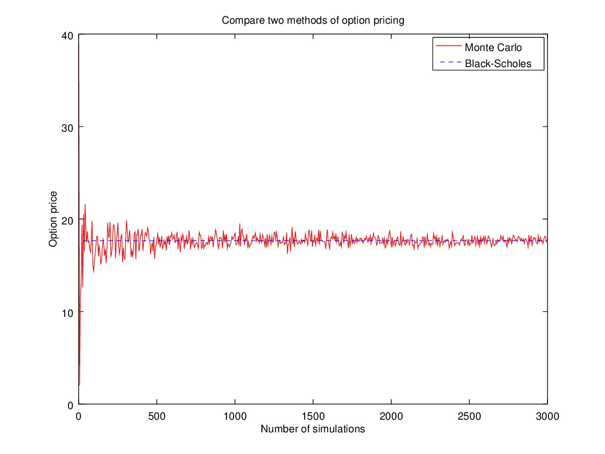

# stochasticCalculus
Provide an intro on different stochastic calculus methods in Octave.

For example, we compare two pricing methods: Monte Carlo and Black Scholes

We also compare the accuracy of Euler and Milstein methods
